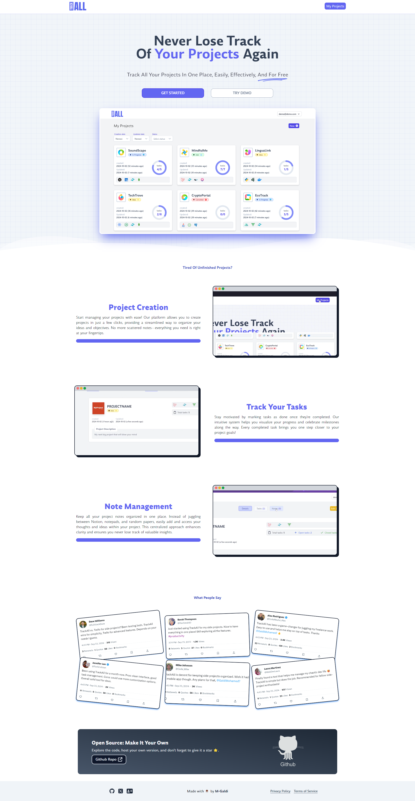

# TrackALL - Simplify Your Project Tracking



[](https://track-all-eta.vercel.app/projects)  

Open-source | Built with ☕ using Nuxt, Supabase, and TailwindCSS

## ✨ Overview

TrackALL is a simple and intuitive platform for managing your side projects, tasks, and notes—all in one place. Whether you’re a solo developer or working with a team, TrackALL gives you the clarity you need to stay on top of things without the overwhelming complexity of other project management tools.

I built TrackALL to practice **Vue** and **Nuxt**, and to create a lightweight solution to track my own projects. The result is a free, open-source tool that’s perfect for developers who just want to focus on building, not managing complex workflows.

## 🌟 Features

- **Effortless Project Creation**: Quickly set up your projects with just a few clicks.
- **Task Tracking**: Create tasks, assign deadlines, and mark them as done once completed.
- **Note Management**: Add project notes to centralize ideas, feedback, and insights in one place.
- **Simple, Not Overwhelming**: Unlike other tools, TrackALL is designed to keep you focused on your projects, not the process.

## 💻 Tech Stack

- **Nuxt 3** - Frontend framework based on Vue.js, providing SSR, static site generation, and more.
- **Supabase** - Backend as a service for authentication and database management.
- **Tailwind CSS** - Utility-first CSS framework for building custom designs.
- **PrimeVue** - Feature-rich UI component library for Vue applications.
- **NuxtUI** - A clean, modern UI library for building interactive and responsive interfaces.

## 🚀 Live Demo

You can check out the live version of TrackALL on Vercel:  
🔗 [TrackALL - Live Demo](https://track-all-eta.vercel.app/projects)

## 🛠️ Getting Started

### Prerequisites

- Node.js (version 14 or higher)
- NPM or Yarn

### Installation

1. **Clone the repo**
```bash
git clone https://github.com/your-username/trackall.git
```
2. **Navigate to the project directory**

```bash
cd trackall
```

3. **Install dependencies**  

Using NPM:

```bash
npm install
```

Or using Yarn:

```bash
yarn install
```

4. **Set up environment variables**  
   Add your Supabase credentials and other necessary environment variables in a `.env` file.

5. **Run the development server**

```bash
npm run dev
```

The app will be running at `http://localhost:3000`.

## 🤝 Contributing

TrackALL is open-source and contributions are welcome! If you’d like to report issues, suggest improvements, or add new features, feel free to fork the repo and submit a pull request.

### How to contribute:

1. Fork the repository.
2. Create your feature branch (`git checkout -b feature/my-feature`).
3. Commit your changes (`git commit -m 'Add some feature'`).
4. Push to the branch (`git push origin feature/my-feature`).
5. Open a pull request.

## 📝 License

This project is licensed under the [MIT License](https://mit-license.org/) - see the LICENSE file for details.
